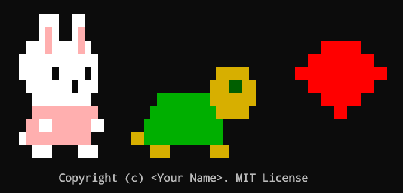
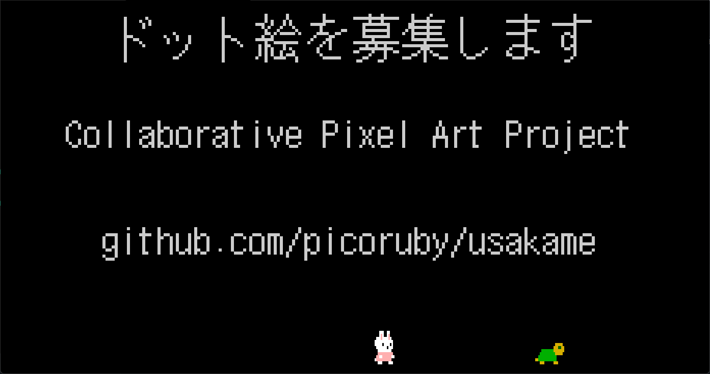

# Rapicco - Collaborative Pixel Art Project

Welcome to Rapicco, a collaborative pixel art project where contributors can help improve and create beautiful ASCII-style pixel art! 🎨



## What is this?

This project renders pixel art characters in your terminal using Ruby. Currently featuring:
- **Rapiko** - A cute white rabbit
- **Camerlengo** - A colorful companion
- **Bullet** - A red projectile

## Rapicco???

Rapicco is a [Rabbit](https://rabbit-shocker.org/index.html.en)-like presentation tool that runs on PicoRuby.
Rapiko steps along with the current slide page number while Camerlengo walks constantly to show the remaining time of your presentation.



## Getting Started

### Prerequisites
- Ruby installed on your system
- Terminal that supports ANSI color codes

### How to Run

1. Clone this repository
2. Navigate to the project directory
3. Run the main script:
   ```bash
   ./main.rb
   ```

The program will:
- Display a color palette (colors 0-255)
- Show all three pixel art characters side by side
- **Automatically refresh** when you edit `data.rb`

## How to Contribute

### What You Can Edit
**ONLY edit `data.rb`** - this file contains:
- Color palette definitions (`$palette`)
- Pixel art data for all characters (`$rapiko`, `$camerlengo`, `$bullet`)

### Editing Guidelines

1. **Colors**: Modify the `$palette` hash to change available colors (use ANSI 256-color codes 0-255)
2. **Pixel Art**: Edit the character arrays using these symbols:
   - `.` = transparent/empty space
   - Any letter = refers to a color in `$palette`

3. **Character Constraints**:
   - Rapiko's height should be up to 15 lines
      - *UPDATE:* As of August 2025, *8 LINES* of Sprites Are Wanted!!! 
   - Rapiko's fur should be white
   - Camerlengo's height should equal Rapiko's height

### Caveat
- One pixel is NOT square because it is a half-width character
- Two adjacent pixels compose a square, but it wouldn't be a precise square depending on the font. So take it easy :)

### Example Color Codes
- `231` = White
- `232` = Dark gray
- `196` = Bright red
- `34` = Green
- `178` = Yellow
- `22` = Dark green
- `217` = Light pink

## Contributing Process

1. Fork this repository
2. Run `./main.rb` to see the current pixel art
3. Edit `data.rb` to improve the characters
4. **Take a screenshot** of your improved pixel art
5. Create a Pull Request with:
   - Your changes to `data.rb`
   - **A screenshot showing your artistic improvements**
   - Brief description of what you changed

## Screenshots Required!

When submitting a Pull Request, please include a screenshot of the terminal showing your pixel art improvements.
This helps reviewers see your creative contributions at a glance.

## Tips for Contributors

- The program auto-refreshes, so you can see changes instantly
- Experiment with different colors from the 256-color palette
- Keep characters recognizable while adding your artistic flair
- Consider the overall composition when making changes

## Project Structure

```
.
├── main.rb      # Main program (DO NOT EDIT)
├── data.rb      # Pixel art data (EDIT THIS)
├── original.png # Example of a screenshot
├── LICENSE      # License
└── README.md    # This file
```

## Let's Create Art Together!

This project is all about collaborative creativity. Whether you're fixing a pixel, adding details, or completely reimagining a character, your contributions help make this pixel art better for everyone.

Happy pixel painting! 🎨✨

## License

Your contributions will be published under the MIT License.

See [LICENSE](LICENSE)
